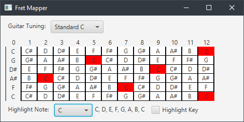

# fret-mapper 
[](https://circleci.com/gh/divanvisagie/fret-mapper)



Map the notes of frets in different tunings

## Building 

```sh
sbt jdkPackager:packageBin
```

```sh
ghr -u divanvisagie v[version number] target/upload
```
`-prerelease` flag to be used in pre releases

[Download](https://github.com/divanvisagie/fret-mapper/releases)